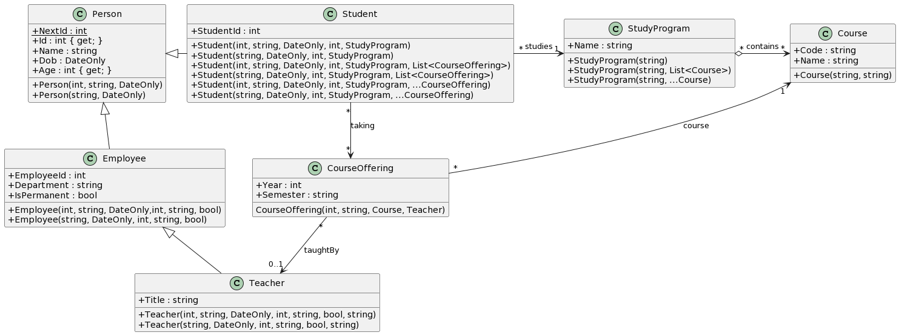

[Diagramme sur PlantUML](https://www.plantuml.com/plantuml/uml/bLDDRvj04BtlhnXnAZMWz9fQLjAu1qjL4icvzBZ64u82kz7k8DLr-UzTM1Pb78A4BsO-tfltXk76aZJKr9MmhwLwaqRMa5VIsbiYKnuQmbskrRxyYt0bH5-1HpHMApWBSB-p8w0oRs5rZtzeTuHhA1NrfLM8u0m5qdTeVVfUrkWArWrGXKzjzS5bjfBmGLKddxijS1BkntznXMJWI4Pap5e-LjlWuMVzLkaJuk1Y5M9kO8jk8rIZeWkzE-j6r5Bvoa7hYjDCgqjOjaF5S87x084fJ2kyGrZ_IzFHI_3sX39_GHEiFPLKNUvxQ64ovsQ6AERmHSXM1A5Uza0YxdHZB3uyFsFN1z7N2D9q0z5LbdsBHZFNGB8fNkZ7ATZqkE3oJX-voSaxyvXHzoYDSmOjWVitIlF-BFPOeoKqd9nZ-MfzBGbkkec3_CXvNATfRvipEFQyJuYWRa_D4HK5MKF8JZOaPzzirtDwDBemieuvR25YmQ04VfMMrjpZPl7uUPxbeh8iurGB5CsGi4yK1Z8n_FiRttJldX5rz-J24YtlTAsJvq7orJs4ws1Cvqy_WVTjWxluqmfRzcQkRrn1Pvr9wQHhPg6_R4MoL5RSe3esTVKV)

````plantuml
@startuml
skinparam classAttributeIconSize 0

class Person {
    {static} +NextId : int
    +Id : int { get; }
    +Name : string
    +Dob : DateOnly
    +Age : int { get; }
    +Person(int, string, DateOnly)
    +Person(string, DateOnly)
}

class Employee {
    +EmployeeId : int
    +Department : string
    +IsPermanent : bool
    +Employee(int, string, DateOnly,int, string, bool) 
    +Employee(string, DateOnly, int, string, bool) 
}
Person <|-- Employee

class Teacher {
    +Title : string
    +Teacher(int, string, DateOnly, int, string, bool, string)
    +Teacher(string, DateOnly, int, string, bool, string)
}
Employee <|-- Teacher
CourseOffering "*" --> "0..1" Teacher : taughtBy

class Course {
    +Code : string
    +Name : string
    +Course(string, string)
}

class CourseOffering {
    +Year : int
    +Semester : string
    CourseOffering(int, string, Course, Teacher)
}
Course "1" <-- "*" CourseOffering : course


class Student {
    +StudentId : int
    +Student(int, string, DateOnly, int, StudyProgram)
    +Student(string, DateOnly, int, StudyProgram)
    +Student(int, string, DateOnly, int, StudyProgram, List<CourseOffering>)
    +Student(string, DateOnly, int, StudyProgram, List<CourseOffering>)
    +Student(int, string, DateOnly, int, StudyProgram, ...CourseOffering)
    +Student(string, DateOnly, int, StudyProgram, ...CourseOffering)
}
Person <|- Student
Student "*" -> "1" StudyProgram : studies
Student "*" --> "*" CourseOffering : taking

class StudyProgram {
    +Name : string
    +StudyProgram(string)
    +StudyProgram(string, List<Course>)
    +StudyProgram(string, ...Course)
}
StudyProgram "*" o-> "*" Course : contains
@enduml
````