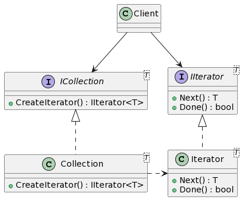
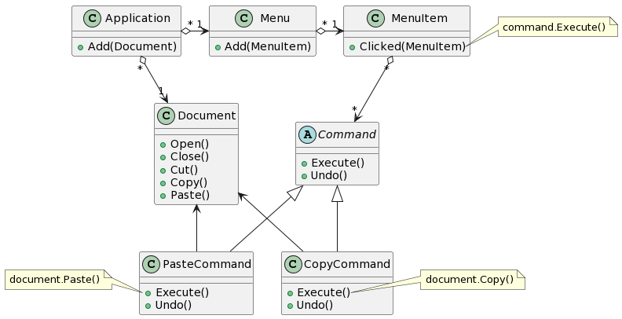
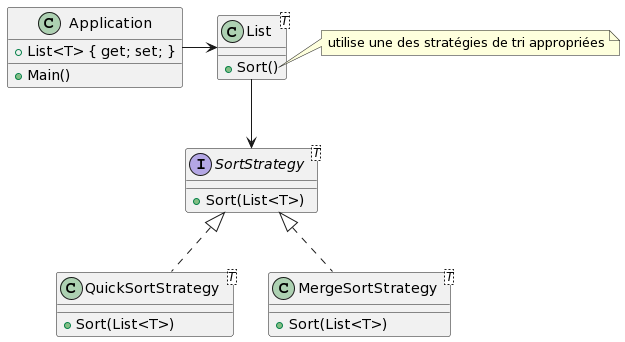

# *Design Patterns* : Comportementaux (*Behavioral*)

## Itérateur (*Iterator*, *Enumerator*, *Cursor*)

### Intention

Fournir un moyen de parcourir séquentiellement les éléments d'un objet composé.

### Mise en contexte

On a une collection d'objets (une liste, un tableau, un graphe, ...) et on
doit parcourir tous les objets de cette collection, possiblement avec une
boucle (`for`, `foreach` ou `while`).

### Détails

````plantuml
@startuml
class Client {}

interface ICollection<T> {
    +CreateIterator() : IIterator<T>
}

interface IIterator<T> {
    +Next() : T
    +Done() : bool
}

class Collection<T> {
    +CreateIterator() : IIterator<T>
}

class Iterator<T> {
    +Next() : T
    +Done() : bool
}

Client --> ICollection
Client --> IIterator

ICollection <|.. Collection
IIterator <|.. Iterator

Collection .> Iterator
@enduml
````



Pour parcourir tous les éléments d'une `Collection`, on peut créer un `Iterator`
, et faire une boucle sur l'itérateur tant que `Done` retourne faux (tant que ce
n'est pas fini).

````csharp
ICollection<int> col = new Collection<int>();
//...
IIterator<int> iter = col.CreateIterator();
while (!iter.Done()) {
    int x = iter.Next();
    //...
}
````

-------------------------------------------------------------------------------

## Chaîne de responsabilité (*Chain of responsibility*)

### Intention

Éviter le couplage de l'émetteur d'une requête au receveur de cette requête en
donnant à plus d'un objet la chance de traiter la requête. Chaîner les objets
receveurs et passer la requête au suivant sur la chaîne pour traiter la requête
à sont tour.

### Mise en contexte

La chaîne de responsabilité est souvent liée aux applications qui doivent gérer
et traiter des évènements pour donner la chance d'associer plusieurs
gestionnaires (*handlers*) à des évènements.

Domaines d'applications :

1. Évènements d'interface graphiques
    - Exemple : plusieurs gestionnaires associés à l'évènement *fermeture de
      fenêtre*
        1. gestionnaire qui vérifie si des fichiers ont été modifiés depuis la
           dernière sauvegarde et qui propose de les enregistrer avant de
           quitter
        2. gestionnaire qui libère les resources utilisées (mémoire, fichiers
           temporaires, ...) incluant la fenêtre elle-même
2. Requêtes reçues par un serveur web
    - Exemple :
        1. *logger* qui enregistre les requêtes reçues dans des fichiers `.log`
           ou qui les affiche dans la console
        2. gestionnaire d'authentification qui valide un jeton (*token*) qui
           doit être inclus dans chaque requête sur des pages protégées
        3. gestionnaire qui traite la requête en tant que telle, qui va
           possiblement accéder à la BD et retourner un document HTML ou JSON
           dans la réponse

-------------------------------------------------------------------------------

## Commande (*Command*, *Action*, *Transaction*)

### Intention

Encapsuler une requête dans un objet qui permet de paramétrer des clients avec
des gestionnaires différents, et qui pourraient supporter des fonctions de
type *annuler*.

### Mise en contexte

Peut-être relié au *design pattern* de la chaîne de responsabilité et d'autres
*design patterns*. Chaque gestionnaire dans une chaîne de responsabilité
pourrait être représenté sous forme de commande.

Une commande peut aussi être utilisée pour représenter les
fonctions de première classe (*first class functions*) dans les langages de
programmation qui ne les supportent pas directement. En C#, par exemple, les
fonctions fléchées sont des raccourcis pour créer des objet de type `Action`
ou `Func`. Une `Action` est essentiellement une fonction qui ne retourne pas de
valeur, donc une action est techniquement une procédure, et une `Func` est une
fonction qui retourne une valeur. Une `Action` ou une `Func` peut être manipulée
comme n'importe quel autre objet, et sont 2 variations du patron *commande* en
C#.

### Détails

````plantuml
@startuml
class Application {
    +Add(Document)
}

class Menu {
    +Add(MenuItem)
}

class MenuItem {
    +Clicked(MenuItem)
}
note right of MenuItem::Clicked
    command.Execute()
endnote

abstract class Command {
    +Execute()
    +Undo()
}

class CopyCommand {
    +Execute()
    +Undo()
}
note right of CopyCommand::Execute
    document.Copy()
endnote

class PasteCommand {
    +Execute()
    +Undo()
}
note left of PasteCommand::Execute
    document.Paste()
endnote

class Document {
    +Open()
    +Close()
    +Cut()
    +Copy()
    +Paste()
}

Application "*" o-> "1" Menu
Application "*" o--> "1" Document
Menu "*" o-> "1" MenuItem
MenuItem "*" o--> "*" Command
Command <|-- CopyCommand
Command <|-- PasteCommand
Document <-- CopyCommand
Document <-- PasteCommand
@enduml
````



Les `Undo` font l'inverse des `Execute`. Pour supporter les *undo* et *redo*,
l'application doit conserver un historique des commandes, et créer des
commandes `UndoCommand` et `RedoCommand` qui vont, en utilisant l'historique de
commandes, appeler soit `Undo` ou `Execute` sur les commande de l'historique
selon le cas.


-------------------------------------------------------------------------------

## Observateur (*Observer*, *Dependents*, *Publish-Subscribe*)

### Intention

Définir une dépendance un-à-plusieurs entre des objets qui lorsqu'un objet
change d'état, tous ses dépendants sont avertis et mis à jour automatiquement.

### Mise en contexte

Des observateurs peuvent s'enregistrer auprès d'un objet (le sujet), et vont
être notifiés quand le sujet change d'état (quand les attributs changent de
valeurs). On peut aussi dire que les observateurs s'abonnent, ou sont associés,
au sujet.

#### Interfaces graphiques

Ce patron et ses dérivés, sont souvent utilisés dans les applications avec
interfaces graphiques. Quand les données d'un modèle sont modifiées, alors les
vues reçoivent des notifications et sont misent à jour automatiquement.
Plusieurs variantes ou dérivées plus ou moins complexes sont possibles, comme
par exemple les architecture MVC (*Model-View-Controller*) et MVVM
(*Model-View-ViewModel*).

Avec le MVC, le modèle est le sujet, et la vue est l'observateur. Avec le MVVM,
le modèle est encore le sujet, mais l'observateur est normalement dans le *
ViewModel*. Il existe aussi plusieurs autres variations pour les interfaces
graphiques, dépendamment si elles sont pour des applications bureau, mobile,
web, ou un mélange de celles-ci.

#### Communications

Le patron *Observateur* est aussi utilisé pour les communications de type
diffusion (*broadcast*). Les utilisateurs peuvent s'inscrire à un service de
diffusion de messages (le sujet), et par le fait même deviennent des
observateurs du sujet. Techniquement, ce ne sont pas exactement les utilisateurs
qui deviennent les observateurs, mais des objets les représentant sont
enregistrés auprès du sujet qui les contactera lors d'un mise à jour. C'est de
là que vient le nom *Publier-S'abonner* (*Publish-Subscribe*).

Les notifications poussées (*push notifications*) fonctionnent aussi un peu de
la même façon, dans les applications de clavardage par exemple.

-------------------------------------------------------------------------------

## Stratégie (*Strategy*, *Policy*)

### Intention

Définir une famille d'algorithmes, encapsuler chaque algorithme, et s'assurer
qu'ils sont interchangeables. Permet à une algorithme de varier indépendamment
des clients qui l'utilise.

### Mise en contexte

#### Exemple, à deux niveaux différents, dans le contexte des algorithmes de tri, dans le langage C#.

Au niveau supérieur, il y a une application qui a besoin de trier les éléments
dans une liste (ou un tableau ou autre collection). Comme spécifié dans
la [documentation](https://learn.microsoft.com/en-us/dotnet/api/system.collections.generic.list-1.sort?view=net-6.0)
, on peut utiliser la méthode `List<T>.Sort()` sur n'importe quelle liste pour
la trier. L'algorithme utilisé pourrait être n'importe quelle algorithme (on
fait confiance aux développeurs d'utiliser un algorithme efficace). Donc, la
strategy exacte utilisée est déterminée à l'interne dans la classe `List`, et en
principe, elle pourrait varier selon les situations. Par exemple, la stratégie
utilisée pourrait varier si la liste est courte ou si elle est longue.

**Note** : ce diagramme ne représente pas exactement ce qui est fait en C#, mais
donne l'idée générale du principe.

````plantuml
@startuml
class Application {
    +List<T> { get; set; }
    +Main()
}

class List<T> {
    +Sort()
}
note right of List::Sort()
    utilise une des stratégies de tri appropriées
endnote
Application -> List

interface SortStrategy<T> {
    +Sort(List<T>)
}
class QuickSortStrategy<T> {
    +Sort(List<T>)
}
class MergeSortStrategy<T> {
    +Sort(List<T>)
}

List --> SortStrategy
SortStrategy <|.. QuickSortStrategy
SortStrategy <|.. MergeSortStrategy
@enduml
````



En C#, il n'est pas possible pour l'application de choisir la stratégie utilisée
pour trier la liste, mais on pourrait créer une alternative à  `List<T>.Sort()`
qui nous permettrait de faire ce choix.

#### Comparateur

On peut utiliser des **comparateurs** (interface `IComparer<T>`) pour trier une
liste selon des critères variables, différents des critères par défaut. Si on ne
donne aucun paramètre à `Sort`, l'ordre par défaut sera utilisé pour trier les
éléments. Dans ce cas, le type `T` doit implémenter l'interface `IComparable<T>`
, qui défini la méthode `compareTo`, pour pouvoir comparer les éléments de la
liste et déterminer l'ordre relatif des éléments.

Si `T` n'implémente pas `IComparable<T>`, ou si nous voulons spécifier un ordre
différent pour le tri, alors bous pouvons donner un `IComparer` à la
méthode `Sort` pour trier les éléments selon l'ordre désiré. Les
différents `IComparer` peuvent être considérés comme des stratégies différentes
dans le processus de tri des éléments.

````plantuml
@startuml
interface IComparer<T> {
    +Compare(T?, T?) : int
}
class NameAscComparer<Person> {
    +Compare(Person?, Person?) : int
}
class NameDescComparer<Person> {
    +Compare(Person?, Person?) : int
}

IComparer <|.. NameAscComparer
IComparer <|.. NameDescComparer
@enduml
````