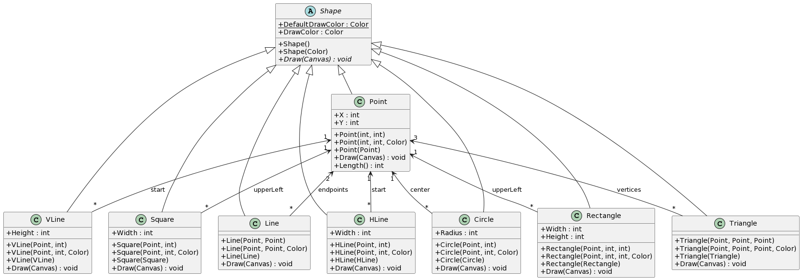
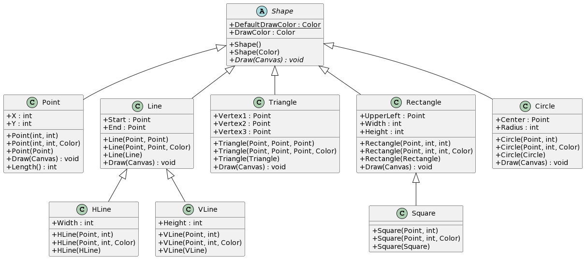
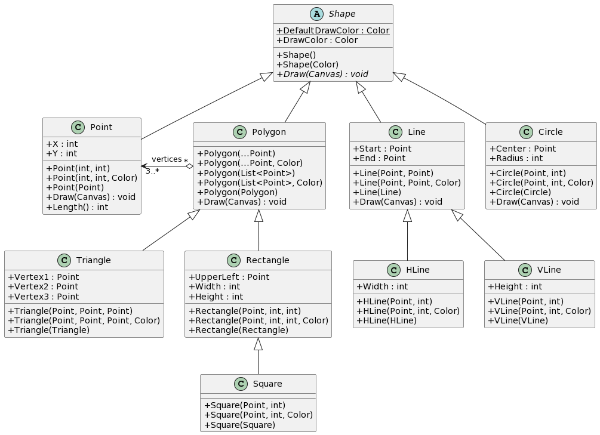

# Diagramme de classes avec PlantUML

## ShapesLib

- Engin de rendu différent
[https://plantuml.com/fr/graphviz-dot](https://plantuml.com/fr/graphviz-dot)
  - ajouter la ligne suivante après la ligne `@startuml` 
  
    `!pragma layout smetana`

### Diagramme de classes V1

[plantuml.com](https://www.plantuml.com/plantuml/uml/ZPBFRjmW4CRlF0NQarqtKl_SgXnIRGwfj8SgMxdjaU396jMBNHYdKhVxxiLCPec58_bW6BvlO7w6kV6e78x7JlXVnWxAgQFKdVB-Cw8p3oF25ztRlVaByfrG3nwTqaWPSj-g0UH9I7aAfw3HPrdTmgCQExnrwi-sxtedFyauXwHgKOo756KAepEjJrpkJ5kBhR9FofTXzrDl6d4MWZY-ziPYvAX-13Cifl3dSrX5kmZVssbTpeGuK4NMurYAnPBL3km1swAaimC2tS7rlwihmc2ckvsn49YgxwR1bb6YIXK89fSOXvquBkFCoyT4GNUnUR-Hrq7RlDcG7dR4XsQycl7km1nQPBuwuyiavcEdNijNly9NB_4ntilYz32vnaXihGLwoVCXyJpZW6s6oVECzCqPPGzTnE9uXi64kRq8cx8uM0FDkGp-CO6pDUq3XqR3XVqUD9ANTUJi_IzvJ9uQ8VVoZaWf7AtvfqINTqVomivn6C3juF7I9VlVetBvFv4yQ-EaPTHiqRI6bp9pM38MIRV6QRhzUzMOqJCgwNDKrd9KjcXQWqgPEIeP4we6Y-343TXcF7R_0G00)



````plantuml
@startuml
skinparam classAttributeIconSize 0
abstract class Shape {
  {static} +DefaultDrawColor : Color
  +DrawColor : Color
  +Shape()
  +Shape(Color)
  {abstract} +Draw(Canvas) : void
}

class Point {
  +X : int
  +Y : int
+Point(int, int)
+Point(int, int, Color)
+Point(Point)
+Draw(Canvas) : void
+Length() : int
}
Shape <|-- Point

class HLine {
+Width : int
+HLine(Point, int)
+HLine(Point, int, Color)
+HLine(HLine)
+Draw(Canvas) : void
}
Shape <|-- HLine
Point "1" <-- "*" HLine : start

class VLine {
+Height : int
+VLine(Point, int)
+VLine(Point, int, Color)
+VLine(VLine)
+Draw(Canvas) : void
}
Shape <|-- VLine
Point "1" <-- "*" VLine : start

class Line {
+Line(Point, Point)
+Line(Point, Point, Color)
+Line(Line)
+Draw(Canvas) : void
}
Shape <|-- Line
Point "2" <-- "*" Line : endpoints

class Triangle {
+Triangle(Point, Point, Point)
+Triangle(Point, Point, Point, Color)
+Triangle(Triangle)
+Draw(Canvas) : void
}
Shape <|-- Triangle
Point "3" <-- "*" Triangle : vertices

class Rectangle {
+Width : int
+Height : int
+Rectangle(Point, int, int)
+Rectangle(Point, int, int, Color)
+Rectangle(Rectangle)
+Draw(Canvas) : void
}
Shape <|-- Rectangle
Point "1" <-- "*" Rectangle : upperLeft

class Square {
+Width : int
+Square(Point, int)
+Square(Point, int, Color)
+Square(Square)
+Draw(Canvas) : void
}
Shape <|-- Square
Point "1" <-- "*" Square : upperLeft

class Circle {
+Radius : int
+Circle(Point, int)
+Circle(Point, int, Color)
+Circle(Circle)
+Draw(Canvas) : void
}
Shape <|-- Circle
Point "1" <-- "*" Circle : center

@enduml
````

### Diagramme de classe V2

[plantuml.com](https://www.plantuml.com/plantuml/uml/ZPBDRgim48NtVWelGIJI_TbTtKKgKYcLigX2Izkb0qwmIWorXxHgcdUlyTHn245Y0HwVSuo_CPvfO0gQNKdqgv0rKsn7iv9fVGEWnBe1VfTLCX6VdFuYRAr1iGmmGPE2rPmU2AK73Gn4TgJHd6zOKy9SiVUuAYj5_r4xcb1qLRGV2K9VMgUT7znsHrmQn4pkcGxDwdqbSd8a13dkAo71SaJFnZIJjdpvAIDh1-QPjFFmKfWWoqctxv1StJ9QShc58WZnsmO1p-3_rtIA68vfiHII6wOeQS_NnD6DdaGEXIEp8TmGsRpKfqF7lWVeEZGsw6ZI0Pe55zi274xQnqa7ST19n-AavpW3DBSozvFpZV6Nz3MFWzPOc7EM1oMOt9QM9-KA-CTl3u72dqlXhnVSyWii91wqk_0-vOenJRYiQsJ5CpXrybZNN2tvPl3cTNxyQQd3z3TWsFFuFeBLk0OyiEiWUMkO6eMFoUvLxMeUq5iuZ473fEEAXShmM6CkWIiFjMAvQBIZmboN2hK-bRTm64E5IJBZCczsvJS0)



````plantuml
@startuml
skinparam classAttributeIconSize 0
abstract class Shape {
  {static} +DefaultDrawColor : Color
  +DrawColor : Color
  +Shape()
  +Shape(Color)
  {abstract} +Draw(Canvas) : void
}

class Point {
  +X : int
  +Y : int
+Point(int, int)
+Point(int, int, Color)
+Point(Point)
+Draw(Canvas) : void
+Length() : int
}
Shape <|-- Point

class HLine {
+Start : Point
+Width : int
+HLine(Point, int)
+HLine(Point, int, Color)
+HLine(HLine)
+Draw(Canvas) : void
}
Shape <|-- HLine

class VLine {
+Start : Point
+Height : int
+VLine(Point, int)
+VLine(Point, int, Color)
+VLine(VLine)
+Draw(Canvas) : void
}
Shape <|-- VLine

class Line {
+Start : Point
+End : Point
+Line(Point, Point)
+Line(Point, Point, Color)
+Line(Line)
+Draw(Canvas) : void
}
Shape <|-- Line

class Triangle {
+Vertex1 : Point
+Vertex2 : Point
+Vertex3 : Point
+Triangle(Point, Point, Point)
+Triangle(Point, Point, Point, Color)
+Triangle(Triangle)
+Draw(Canvas) : void
}
Shape <|-- Triangle

class Rectangle {
+UpperLeft : Point
+Width : int
+Height : int
+Rectangle(Point, int, int)
+Rectangle(Point, int, int, Color)
+Rectangle(Rectangle)
+Draw(Canvas) : void
}
Shape <|-- Rectangle

class Square {
+UpperLeft : Point
+Width : int
+Square(Point, int)
+Square(Point, int, Color)
+Square(Square)
+Draw(Canvas) : void
}
Shape <|-- Square

class Circle {
+Center : Point
+Radius : int
+Circle(Point, int)
+Circle(Point, int, Color)
+Circle(Circle)
+Draw(Canvas) : void
}
Shape <|-- Circle
@enduml
````

### Diagramme de classe V3

[plantuml.com](https://www.plantuml.com/plantuml/uml/ZP9DxzCm3CRl-HGvjYf_YPSRuZ3K8Grf1xH2WQFNPcj4bvR47OYnxqxhu6MXOzfXYVFOwVEpbuL3i3WSMk6-QTE3XOEiMd3kBQBLsm7L-wepXVwbv7C1MuSMAlGLicYWL_8af3mv1DJLMMPBjOEXnQM57tdNTbQ-bhIFHTbDaJwIf26ap7G-iTtPNqroC4TmwNZxsEbQd8Nm71ywRP0uiYzZSZnCuTU_OKRfPFmzcyvf9D3Y7LcdDHKtBRErCdjiajH_UqJmCtZp--d9Op3JQgtDD9liiwwnOHHIoO5XPXBZS8RMT7IQTcz44XkLRBHIUjyWEvLpf_8_JfmfvqxbjHCR5GXsyl7zPkzC7GxN5Zp8M0l6d9gMs_EEvtlDyj5gCFkMU4fbKVrymH0ilFnNU1K4lXvZCV6zT80FLHmyqWJNSYCRLU6baqzzh-nQxS9qu-SJ_yMNgup9Ited5_132KUFD120kOFY-m2My2cA7rtGPW2SeetUNPW5EVa4s-JQLdvAkJAeR1ZH1cezE9wAhuiXM9j3S8gsX_htbK8ibAc7G_i7)


````plantuml
@startuml
skinparam classAttributeIconSize 0
abstract class Shape {
  {static} +DefaultDrawColor : Color
  +DrawColor : Color
  +Shape()
  +Shape(Color)
  {abstract} +Draw(Canvas) : void
}

class Point {
  +X : int
  +Y : int
+Point(int, int)
+Point(int, int, Color)
+Point(Point)
+Draw(Canvas) : void
+Length() : int
}
Shape <|-- Point

class HLine {
+Width : int
+HLine(Point, int)
+HLine(Point, int, Color)
+HLine(HLine)
}
Line <|-- HLine

class VLine {
+Height : int
+VLine(Point, int)
+VLine(Point, int, Color)
+VLine(VLine)
}
Line <|-- VLine

class Line {
+Start : Point
+End : Point
+Line(Point, Point)
+Line(Point, Point, Color)
+Line(Line)
+Draw(Canvas) : void
}
Shape <|-- Line

class Triangle {
+Vertex1 : Point
+Vertex2 : Point
+Vertex3 : Point
+Triangle(Point, Point, Point)
+Triangle(Point, Point, Point, Color)
+Triangle(Triangle)
+Draw(Canvas) : void
}
Shape <|-- Triangle

class Rectangle {
+UpperLeft : Point
+Width : int
+Height : int
+Rectangle(Point, int, int)
+Rectangle(Point, int, int, Color)
+Rectangle(Rectangle)
+Draw(Canvas) : void
}
Shape <|-- Rectangle

class Square {
+Square(Point, int)
+Square(Point, int, Color)
+Square(Square)
}
Rectangle <|-- Square

class Circle {
+Center : Point
+Radius : int
+Circle(Point, int)
+Circle(Point, int, Color)
+Circle(Circle)
+Draw(Canvas) : void
}
Shape <|-- Circle

@enduml
````

### Diagramme de classe V4

[plantuml](https://www.plantuml.com/plantuml/uml/ZPDVZn8n5CNV-oagJumZHDqtGyWQrcHDU32BeZvsXouq3Xrixwn_aEzkvvP3IOTize7spZdj_4uldMjFob6xhSKBskYjbfMZqTffRON_OUnEERMLLQsyVq_ap7rB-cFLs8Nvg-Lh8TYHYutQQJcPg7jFJbKqdSgzs7jIPAg3B6_qWsfhkd7grwof6oVVIPv5UK7YTmqB5AmMOezN7oHl6iwKVLI-2FiU6xCI1qJvr1XBWLv-2rOeHVaT1Ll3y7lLFHUP48R8WivZ8IxYohcsQzeCY_ZkW3-suDze52CWp-tSMDtb-MfMj44KLYC1ON89SU3mM0HIDqSGIm0j0RhLPhqXa9OvgI-116VP9x444a0BKgxZnFEM7-mgFPmZqCXS0nWMOo_t-xo_p4z_T_rdtTWkph4SZiTZ47Cf0U7CZQS9UzFBQd_BSNv6KgGJyL8EhiRZbmCv6JLo46P43nkr8rDfZqDzTaRPTSrDNWPF_tw3pa9ucmjNIS3shDTeoXDsQb1QXQAx48ZCXuE1r7UwebFiBxkTTdFzaEx7-GUGNr9iFMN2K3pXfQnf2Qf-MZYdk8kVhNASbQli6qbQJeF54tFImPaK3M1cnbMn9JDjIRlKZpkrCgr72tXT5W9QFmIiE3tdAiQLGbnhksgtzNy0)



````plantuml
@startuml

skinparam classAttributeIconSize 0

abstract class Shape {
{static} +DefaultDrawColor : Color
+DrawColor : Color
+Shape()
+Shape(Color)
{abstract} +Draw(Canvas) : void
}

class Point {
+X : int
+Y : int
+Point(int, int)
+Point(int, int, Color)
+Point(Point)
+Draw(Canvas) : void
+Length() : int
}
Shape <|-- Point

class HLine {
+Width : int
+HLine(Point, int)
+HLine(Point, int, Color)
+HLine(HLine)
}
Line <|-- HLine

class VLine {
+Height : int
+VLine(Point, int)
+VLine(Point, int, Color)
+VLine(VLine)
}
Line <|-- VLine

class Line {
+Start : Point
+End : Point
+Line(Point, Point)
+Line(Point, Point, Color)
+Line(Line)
+Draw(Canvas) : void
}
Shape <|-- Line

class Polygon {
+Polygon(...Point)
+Polygon(...Point, Color)
+Polygon(List<Point>)
+Polygon(List<Point>, Color)
+Polygon(Polygon)
+Draw(Canvas) : void
}
Shape <|-- Polygon
Point "3..*" <-o "*" Polygon : vertices

class Triangle {
+Vertex1 : Point
+Vertex2 : Point
+Vertex3 : Point
+Triangle(Point, Point, Point)
+Triangle(Point, Point, Point, Color)
+Triangle(Triangle)
}
Polygon <|-- Triangle

class Rectangle {
+UpperLeft : Point
+Width : int
+Height : int
+Rectangle(Point, int, int)
+Rectangle(Point, int, int, Color)
+Rectangle(Rectangle)
}
Polygon <|-- Rectangle

class Square {
+Square(Point, int)
+Square(Point, int, Color)
+Square(Square)
}
Rectangle <|-- Square

class Circle {
+Center : Point
+Radius : int
+Circle(Point, int)
+Circle(Point, int, Color)
+Circle(Circle)
+Draw(Canvas) : void
}
Shape <|-- Circle

@enduml
````